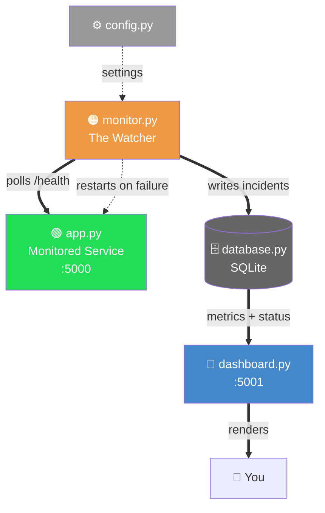
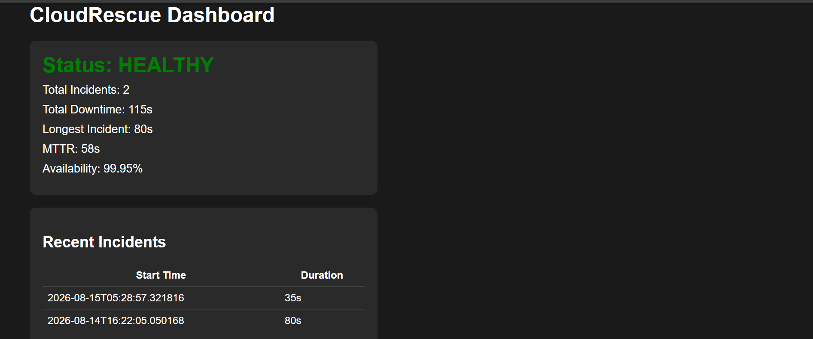
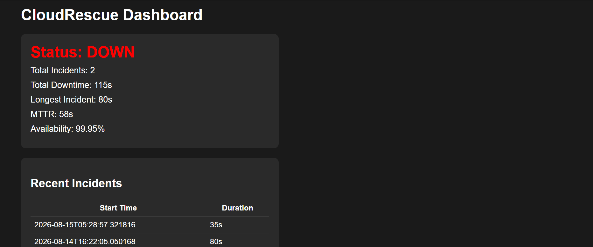
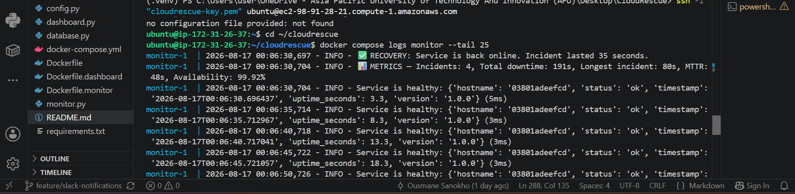

# CloudRescue

**CloudRescue** is a reliability monitoring and bounded recovery system I built to understand how real SRE (Site Reliability Engineering) systems detect failures, alert appropriately, and recover safely , implemented from scratch, not assembled from a tutorial.

## Why I built this

After deploying a service, how do engineers actually know something has gone wrong? How do they track a system's health once it's live, and diagnose exactly what broke? I built CloudRescue to answer these questions for myself  not just to read about SRE practices, but to actually implement detection, alerting, and recovery from scratch, and understand the reasoning behind each design decision.

## Architecture

CloudRescue consists of five components, each with a single responsibility:

- **`app.py`** , a minimal Flask service being monitored, exposing a `/health` endpoint that reports status, uptime, version, and hostname.
- **`monitor.py`** , the core watcher. Polls `/health` on a configurable interval, distinguishes between healthy, degraded ("zombie"), and fully-down states, tracks failures using both consecutive and rolling-time-window counting, triggers alerts, and attempts bounded automatic recovery.
- **`config.py`** , centralizes all tunable settings (thresholds, intervals, limits) as environment variables with sensible defaults, so behavior can be adjusted without touching code.
- **`database.py`** , persists incident history and current status to SQLite, so metrics survive restarts and reflect true, long-term reliability rather than a single session.
- **`dashboard.py`** , a lightweight Flask web dashboard, auto-refreshing every 5 seconds, displaying live status, key metrics (MTTR, availability, downtime), and recent incident history.

`monitor.py` is decoupled from `app.py`'s implementation — it only depends on the HTTP health-check contract, meaning it could monitor any compatible service exposing a similar endpoint, not just this one.

`monitor.py` is decoupled from `app.py`'s implementation — it only depends on the HTTP health-check contract, meaning it could monitor any compatible service exposing a similar endpoint, not just this one.



## State Machine

## State Machine

| Current State | Event | Next State | Action |
|---|---|---|---|
| Healthy | Slow or malformed response | Unhealthy (zombie) | Log warning, increment failure count |
| Healthy | Connection failure | Down | Increment failure count, start incident timer |
| Unhealthy | Healthy response | Healthy | Reset failure count, close incident if open |
| Down | Failure count reaches threshold | Down (alerting) | Fire alert, attempt bounded recovery |
| Down | Recovery succeeds (next check passes) | Healthy | Close incident, persist duration, reset retry count |
| Down | Recovery fails, retries remain | Down | Increment retry count, attempt recovery again |
| Down | Retry cap reached | Down (manual intervention) | Stop attempting recovery, alert remains active |

## Recovery Safety Model

CloudRescue only attempts recovery after a service reaches a confirmed failure threshold — not on the first failed check. Recovery is performed via `subprocess.Popen()`, launching a fresh instance of the monitored service. Recovery attempts are capped (`MAX_RESTART_ATTEMPTS`, default 3) to prevent restart storms; once the cap is reached, the system stops attempting recovery and logs that manual intervention is required, rather than retrying indefinitely. Recovery success is verified through the monitor's next scheduled health check, not assumed immediately after the restart command runs.

**Known constraint:** the restart command itself is not currently configurable or sandboxed , it is hardcoded to relaunch `app.py`. This is acceptable for this project's scope but would need hardening (configurable, validated commands) before use against arbitrary services.

## Features

- **Health monitoring** , polls a `/health` endpoint on a configurable interval
- **Three-state failure detection** , distinguishes healthy, "zombie" (responding but unhealthy), and fully-down states
- **Dual alerting strategies** , consecutive-failure detection *and* rolling time-window detection. Consecutive detection catches sustained outages quickly; the rolling window catches intermittent/flaky failures that never fail three times in a strict, unbroken row but still indicate a real problem
- **Alert suppression** , alerts fire once per incident, not repeatedly, avoiding alert fatigue
- **Bounded automatic recovery** , restarts a crashed service, with a capped retry limit to prevent restart storms
- **Incident tracking** , records every incident's start time and duration to a persistent database
- **Reliability metrics** , calculates incident-based MTTR and Availability % from persisted detection and recovery timestamps
- **Structured logging** , uses Python's standard `logging` module with proper severity levels (INFO/WARNING/ERROR/CRITICAL)
- **Configuration via environment variables** , all thresholds and intervals adjustable without code changes
- **Live dashboard** , auto-refreshing web view of current status, metrics, and recent incident history
- **Response time monitoring** , measures latency, flags degraded performance separately from outright failure
- **Real-time Slack notifications** , critical alerts are delivered directly to a Slack channel via an Incoming Webhook, not just logged, so a human is actually notified without needing to check logs

## Screenshots

## Screenshots

**Dashboard — healthy status:**


**Dashboard — active incident:**


**Monitor logs — recovery detected:**

## Failure-Injection Testing

All testing was performed through deliberate manual fault injection (stopping/breaking the monitored service and observing the response), rather than an automated suite. This table documents the scenarios verified during development:

| Scenario | Expected Result | Observed Result |
|---|---|---|
| Normal healthy response | Status remains healthy | ✅ Passed |
| Delayed response (simulated latency) | Status flagged as degraded (warning/critical) | ✅ Passed |
| Process stopped completely | Incident opens, recovery attempted after threshold | ✅ Passed |
| Recovery succeeds | Incident closes, duration persisted, retry count resets | ✅ Passed |
| Recovery fails repeatedly | Retry cap reached, further attempts stop | ✅ Passed |
| Intermittent/flaky failures (random 50% failure rate) | Rolling-window alert triggers despite no 3-in-a-row failure | ✅ Passed |
| Monitor process restarted mid-session | Incident history and monitoring start time persist correctly | ✅ Passed |

*(A formal `pytest` suite covering these same scenarios is a planned improvement — see Future Improvements.)*

## Metrics Definitions

To avoid ambiguity, CloudRescue's metrics are defined precisely as follows:

- **Availability %** = (total monitoring time − total downtime) / total monitoring time × 100, calculated since the first-ever monitoring session (persisted across restarts).
- **MTTR (Mean Time To Recovery)** = total downtime ÷ number of resolved incidents. An incident is only counted once it has *resolved* (recovery confirmed) — an ongoing, unresolved incident is not yet included in these totals.
- **Downtime** is measured from the moment of first detected failure (not the true moment the service actually broke, which may predate detection by up to one polling interval).
- All timestamps are stored in ISO 8601 format, in the system's local time.

## Installation & Usage

### Requirements
- Python 3.10+
- `pip`

### Setup

1. Clone the repository:

git clone https://github.com/OusmaneSanokho/cloudrescue.git
cd cloudrescue


2. Install dependencies:

pip install -r requirements.txt


3. Run the three components, each in its own terminal:

python app.py # the monitored service (port 5000)
python monitor.py # the watcher
python dashboard.py # the live dashboard (port 5001)


4. Open the dashboard in your browser:

http://127.0.0.1:5001


### Configuration

All thresholds are configurable via environment variables (see `config.py` for the full list and defaults, or `.env.example` for a template):

$env:FAILURE_THRESHOLD=5
$env:POLL_INTERVAL_SECONDS=10
python monitor.py
## Containerization (Docker)

CloudRescue is fully containerized using Docker and Docker Compose. Each of the three runtime components (`app.py`, `monitor.py`, `dashboard.py`) runs in its own isolated container, built from its own Dockerfile (`Dockerfile`, `Dockerfile.monitor`, `Dockerfile.dashboard`), all sharing the same base image (`python:3.11-slim`) and dependency set.

### Why three containers instead of one

`monitor.py` was already architecturally decoupled from `app.py` — it only depends on the HTTP `/health` contract, not on shared memory or direct code access. Splitting each component into its own container preserves that decision: each can be rebuilt, restarted, or fail independently, matching how the components were already designed to relate to each other.

### Networking

Containers reach each other by service name rather than `127.0.0.1` (each container has its own isolated network namespace, so `127.0.0.1` only ever refers to the container itself). `monitor.py`'s target address is set via an `APP_HOST` environment variable, defaulting to `127.0.0.1` for local (non-Docker) use, and overridden to `app` in `docker-compose.yml`.

### Shared SQLite persistence across containers

`monitor.py` and `dashboard.py` both need to read and write the same `cloudrescue.db` file, but containers have separate filesystems by default. This is solved with a named Docker volume (`dbdata`) mounted into both containers, so they share the same physical file rather than separate copies with the same name.

**A real bug found while building this:** mounting the volume directly onto the database file's path (`/app/cloudrescue.db`) caused Docker to create a *folder* at that path instead of treating it as a file mount target (Docker's default behavior for a named volume with nothing yet at that path). SQLite then failed with `unable to open database file`, because it was trying to open a directory as if it were a file. Fixed by mounting the volume on the *parent folder* instead (`/app/data`) and pointing the database path (`DB_PATH`, itself now configurable via environment variable rather than hardcoded) at a file inside that folder.

### Running with Docker Compose

```bash
docker compose up --build
```

This builds all three images and starts all three containers together, networked and sharing the persistent volume. The dashboard is available at `http://localhost:5001`, the monitored service at `http://localhost:5000`.

### Verified: failure injection across containers

The existing manual failure-injection testing (see above) was re-run against the containerized setup by stopping the `app` container directly (`docker stop cloudrescue-app-1`) rather than killing a local process. Failure detection, alert suppression, restart-attempt capping, and recovery detection all behaved identically to the non-containerized version — confirmed via a real 365-second simulated outage, correctly logged, correctly recovered, and correctly reflected in calculated Availability/MTTR once the container was manually restarted.

**A real limitation this test proved, not just predicted:** the automatic recovery mechanism (`subprocess.Popen(["python", "app.py"])`) does not work correctly across container boundaries. When triggered, it spawns a new `app.py` process *inside monitor's own container* rather than restarting the actual `app` container — an unreachable, duplicate process, while the real outage remains unresolved. This is the containerized manifestation of the previously-documented limitation on restart-command generalization (see Limitations), now demonstrated with real logs rather than described theoretically. Correctly restarting a sibling container from within a container would require giving `monitor` access to the Docker Engine itself (e.g., mounting the Docker socket) — a meaningful architectural change with real security tradeoffs, deliberately not implemented in this phase.
## Real-Time Notifications (Slack)

Alerts were previously only logged (`logging.critical`) — visible only if someone was actively watching logs or the dashboard. This is now supplemented with real-time delivery to Slack via an Incoming Webhook.

### How it works

A dedicated Slack app ("CloudRescue Alerts") posts into a `#cloudrescue-alerts` channel using an Incoming Webhook — a unique URL that accepts a simple HTTP POST with a JSON message body. `monitor.py`'s `send_slack_alert(message)` function checks whether `SLACK_WEBHOOK_URL` is configured, and if so, sends the alert text as a POST request with a 5-second timeout. A failed or unconfigured webhook is caught and logged, but never crashes the monitoring loop — notification delivery is treated as best-effort, secondary to the monitoring system's own stability.

This fires alongside both existing alert points (the rolling-window alert and the consecutive-failure alert), preserving the existing `alert_sent` suppression logic — so Slack gets exactly one notification per incident, not repeated spam.

### Configuration

The webhook URL is supplied via the `SLACK_WEBHOOK_URL` environment variable — never hardcoded, never committed. Locally, this is set via a `.env` file (excluded via `.gitignore`) that Docker Compose reads automatically. On the AWS server, a separate `.env` file is created directly via SSH, following the same pattern already used for the SSH private key: real secrets live only on the machines that need them, never in the Git repository.

### Verified

Tested end-to-end in three separate environments: locally via raw Python processes, locally via Docker Compose, and on the live AWS deployment — in each case, a real simulated outage correctly triggered a real Slack message in `#cloudrescue-alerts`, and recovery was correctly logged afterward.
## Live Deployment

CloudRescue isn't just a local demo — it's currently deployed and running on AWS, independent of my laptop being on.

**Live dashboard:** http://98.91.28.21:5001

### Infrastructure

| Item | Value |
|---|---|
| Instance | `i-0aaf9ccd8daaf95b0` (`cloudrescue-server`) |
| Type | `t3.micro` (AWS Free Tier eligible) |
| OS | Ubuntu 26.04 LTS |
| Region | `us-east-1c` |
| Public IP | `98.91.28.21` |

**Update (Docker migration):** the deployment now runs via Docker Compose instead of a Python virtual environment. The original venv-based setup is documented below for historical context, since the debugging process (the externally-managed-environment issue) remains a genuine lesson learned — but it is no longer how the live service actually runs.

Original venv setup (superseded): `apt update && apt upgrade`, installed `python3-venv`, created a virtual environment, and installed dependencies with `pip install -r requirements.txt` inside it. Ubuntu blocks global `pip install` by default (the "externally-managed-environment" protection) — the correct fix is a proper venv, not `pip install --break-system-packages`, which just disables a safety check instead of solving the actual problem.

### Security: restricted access as a deliberate tradeoff

Both SSH (port 22) and the dashboard (port 5001) are locked to "My IP" in the security group, rather than open to `0.0.0.0/0`. This is more secure but means the security group has to be updated manually every time I connect from a different network — I hit this twice in practice (home → school, school → home) and had to update the rule both times. I'm treating this as a known, understood operational tradeoff (security over convenience), not an oversight.

### Keeping processes alive after SSH disconnects

All three processes (`app.py`, `monitor.py`, `dashboard.py`) need to keep running after I close my SSH session — a normal foreground process dies with the terminal.

I first tried `tmux`: it worked fine for `app.py` and `monitor.py`, but `dashboard.py`'s session kept breaking — a corrupted paste left a session running nothing inside it, and repeated attempts at the `Ctrl+B` then `D` detach sequence came through as literal `^Bd` text instead of detaching. This happened in plain PowerShell too, so it wasn't a VS Code terminal quirk — something in the Windows/PowerShell/SSH client chain was swallowing or garbling the keystroke.

I switched to `nohup` instead, which needs no interactive keystroke at all:

\`\`\`bash
nohup python3 app.py > app.log 2>&1 &
nohup python3 monitor.py > monitor.log 2>&1 &
nohup python3 dashboard.py > dashboard.log 2>&1 &
\`\`\`

Verified by closing the terminal completely and confirming the dashboard was still live and responding over 40 minutes later. All three now log to `app.log`, `monitor.log`, and `dashboard.log` respectively.

### Superseded: process management now handled by Docker

The `tmux`/`nohup` approach above was necessary because raw Python processes have no built-in way to survive an SSH disconnect. Since migrating to Docker Compose, this problem is solved natively: containers started with `docker compose up -d` run as background daemons managed by the Docker Engine itself, independent of any SSH session. This was verified directly — the deployment was closed via `exit`, fully terminating the SSH connection, and the dashboard remained reachable and serving live data immediately after, with no `nohup` or `tmux` involved at all.

Deploying an update now means, on the server: `git pull`, then `docker compose up --build -d` to rebuild and restart any changed containers in place.

### A real bug found during deployment: host binding vs. firewall rules

The dashboard was unreachable externally even though the security group rule for port 5001 was correct. I diagnosed it step by step rather than guessing:

1. Confirmed the EC2 instance itself was healthy.
2. Confirmed the security group rule was correct.
3. Ran `curl 127.0.0.1:5001` **from inside the server** — it worked, so the app was running fine.
4. That narrowed it to something between "app is listening" and "the outside world can reach it" — which pointed at Flask's own bind address, not AWS at all.

The cause: `app.run(port=5001)` defaults to binding only to `127.0.0.1` (localhost), so the app refuses any external connection no matter what the firewall allows. Fixed with:

\`\`\`python
app.run(host="0.0.0.0", port=5001)
\`\`\`

The lesson: network-level access control (security groups) and application-level listening behavior (host binding) are two separate layers, and both have to be correct independently — one being right doesn't imply the other is.

### SSH key handling

The private key (`cloudrescue-key.pem`) is stored locally only, added to `.gitignore` (`*.pem`), and was never committed to GitHub.

## Limitations

- **Single point of failure — RESOLVED.** Originally, if the monitor process itself crashed, nothing would watch it. Fixed by adding `restart: unless-stopped` to the monitor service in `docker-compose.yml`. Verified via direct testing: killed the monitor process from inside its own container (`os.kill(1, 9)`), confirmed Docker automatically restarted it without any manual intervention, and confirmed monitoring resumed correctly afterward. Note: an external `docker kill` on the container itself does *not* trigger a restart under this policy — Docker treats an explicit external kill as an intentional stop, by design. This fix specifically covers the process crashing on its own, which is the actual failure mode this limitation described.
- **Restart command does not work across container boundaries** — proven via direct testing (see Containerization section above): `subprocess.Popen(["python", "app.py"])` spawns a new process *inside monitor's own container* rather than restarting the actual `app` container, leaving real outages unresolved despite log messages suggesting a restart occurred. Correctly fixing this would require `monitor` to have access to the Docker Engine itself (e.g., via the Docker socket) to restart a sibling container — a real architectural and security tradeoff, not yet implemented.
- **No authentication on `/health` or the dashboard** — acceptable for a local learning project, not for a real deployment.
- **Single-instance SQLite** — appropriate for one monitor process; would need PostgreSQL only if scaled to multiple monitor instances or remote access.
- **Manual version numbering** — becomes meaningful once actual deployment/build metadata exists.
- **No automated test suite** — all testing was done through documented manual fault injection (see Failure-Injection Testing above).

## Future Improvements

**Done since this section was first written:** Docker + Docker Compose, CI via GitHub Actions, AWS deployment (migrated to Docker Compose), real-time Slack notifications, single-point-of-failure fix (Docker restart policy). Kept below for what's genuinely still outstanding.

**Prioritized next:**
- Expand the `pytest` suite beyond the current two tests (health endpoint, restart-threshold regression) to cover rolling-window detection, alert suppression, recovery/incident persistence, and metrics calculation
- Monitoring ecosystem overview — a conceptual comparison of what CloudRescue manually implements versus what tools like Prometheus, Grafana, and AWS CloudWatch provide

**Also planned, lower priority:**
- Authentication on `/health` and dashboard endpoints
- Auto-generated version numbers (from Git tags/build metadata)
- Prometheus-compatible `/metrics` endpoint
- Generalizing/sandboxing the restart command, and solving the container-boundary restart limitation (likely via Docker socket access)
## Lessons Learned

Building CloudRescue taught me that alerting is far harder to get right than it first appears. A naive "alert on every failure" approach either floods the operator with noise or, in the case of consecutive-only counting, silently misses real problems — flaky services that fail often but never in a strict, unbroken sequence. Getting alerting right required careful, deliberate tuning: consecutive-failure detection, a separate rolling time-window, alert suppression to avoid duplicate noise, and retry caps to prevent the recovery system itself from making things worse.

I also learned that a monitoring system's real value isn't just *detecting* that something is wrong — it's producing a clear enough signal that a human only needs to look when something genuinely requires their attention, and act automatically when it's safe to do so. That balance, between automation and human judgment, shaped almost every design decision in this project: the watcher needed the ability to take real action (restarting a crashed service), but only within carefully bounded limits, with everything logged for accountability.

## Tech Stack

Python, Flask, SQLite, `requests`, Python `logging`

---

*Built by Ousmane Sanokho as a Cloud Engineering / DevOps portfolio project.*