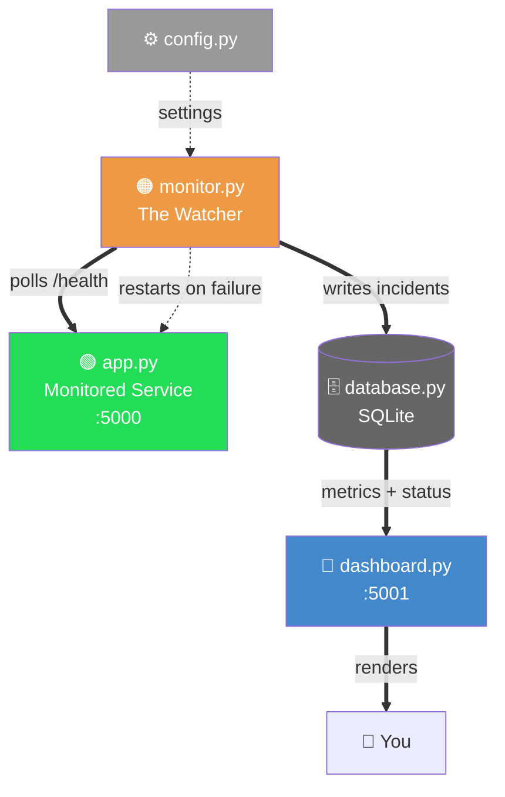

# CloudRescue

**CloudRescue** is a reliability monitoring and bounded recovery system I built to understand how real SRE (Site Reliability Engineering) systems detect failures, alert appropriately, and recover safely — implemented from scratch, not assembled from a tutorial.

## Why I built this

After deploying a service, how do engineers actually know something has gone wrong? How do they track a system's health once it's live, and diagnose exactly what broke? I built CloudRescue to answer these questions for myself — not just to read about SRE practices, but to actually implement detection, alerting, and recovery from scratch, and understand the reasoning behind each design decision.

## Architecture

CloudRescue consists of five components, each with a single responsibility:

- **`app.py`** — a minimal Flask service being monitored, exposing a `/health` endpoint that reports status, uptime, version, and hostname.
- **`monitor.py`** — the core watcher. Polls `/health` on a configurable interval, distinguishes between healthy, degraded ("zombie"), and fully-down states, tracks failures using both consecutive and rolling-time-window counting, triggers alerts, and attempts bounded automatic recovery.
- **`config.py`** — centralizes all tunable settings (thresholds, intervals, limits) as environment variables with sensible defaults, so behavior can be adjusted without touching code.
- **`database.py`** — persists incident history and current status to SQLite, so metrics survive restarts and reflect true, long-term reliability rather than a single session.
- **`dashboard.py`** — a lightweight Flask web dashboard, auto-refreshing every 5 seconds, displaying live status, key metrics (MTTR, availability, downtime), and recent incident history.

`monitor.py` is decoupled from `app.py`'s implementation — it only depends on the HTTP health-check contract, meaning it could monitor any compatible service exposing a similar endpoint, not just this one.

`monitor.py` is decoupled from `app.py`'s implementation — it only depends on the HTTP health-check contract, meaning it could monitor any compatible service exposing a similar endpoint, not just this one.

## State Machine

## State Machine

| Current State | Event | Next State | Action |
|---|---|---|---|
| Healthy | Slow or malformed response | Unhealthy (zombie) | Log warning, increment failure count |
| Healthy | Connection failure | Down | Increment failure count, start incident timer |
| Unhealthy | Healthy response | Healthy | Reset failure count, close incident if open |
| Down | Failure count reaches threshold | Down (alerting) | Fire alert, attempt bounded recovery |
| Down | Recovery succeeds (next check passes) | Healthy | Close incident, persist duration, reset retry count |
| Down | Recovery fails, retries remain | Down | Increment retry count, attempt recovery again |
| Down | Retry cap reached | Down (manual intervention) | Stop attempting recovery, alert remains active |

## Recovery Safety Model

CloudRescue only attempts recovery after a service reaches a confirmed failure threshold — not on the first failed check. Recovery is performed via `subprocess.Popen()`, launching a fresh instance of the monitored service. Recovery attempts are capped (`MAX_RESTART_ATTEMPTS`, default 3) to prevent restart storms; once the cap is reached, the system stops attempting recovery and logs that manual intervention is required, rather than retrying indefinitely. Recovery success is verified through the monitor's next scheduled health check, not assumed immediately after the restart command runs.

**Known constraint:** the restart command itself is not currently configurable or sandboxed — it is hardcoded to relaunch `app.py`. This is acceptable for this project's scope but would need hardening (configurable, validated commands) before use against arbitrary services.

## Features

- **Health monitoring** — polls a `/health` endpoint on a configurable interval
- **Three-state failure detection** — distinguishes healthy, "zombie" (responding but unhealthy), and fully-down states
- **Dual alerting strategies** — consecutive-failure detection *and* rolling time-window detection. Consecutive detection catches sustained outages quickly; the rolling window catches intermittent/flaky failures that never fail three times in a strict, unbroken row but still indicate a real problem
- **Alert suppression** — alerts fire once per incident, not repeatedly, avoiding alert fatigue
- **Bounded automatic recovery** — restarts a crashed service, with a capped retry limit to prevent restart storms
- **Incident tracking** — records every incident's start time and duration to a persistent database
- **Reliability metrics** — calculates incident-based MTTR and Availability % from persisted detection and recovery timestamps
- **Structured logging** — uses Python's standard `logging` module with proper severity levels (INFO/WARNING/ERROR/CRITICAL)
- **Configuration via environment variables** — all thresholds and intervals adjustable without code changes
- **Live dashboard** — auto-refreshing web view of current status, metrics, and recent incident history
- **Response time monitoring** — measures latency, flags degraded performance separately from outright failure

## Screenshots

📸 **[SCREENSHOT: dashboard showing healthy status + metrics]**

📸 **[SCREENSHOT: dashboard showing an active incident, if you have one]**

📸 **[SCREENSHOT: terminal log output showing DOWN → RESTART → RECOVERY sequence]**

## Failure-Injection Testing

All testing was performed through deliberate manual fault injection (stopping/breaking the monitored service and observing the response), rather than an automated suite. This table documents the scenarios verified during development:

| Scenario | Expected Result | Observed Result |
|---|---|---|
| Normal healthy response | Status remains healthy | ✅ Passed |
| Delayed response (simulated latency) | Status flagged as degraded (warning/critical) | ✅ Passed |
| Process stopped completely | Incident opens, recovery attempted after threshold | ✅ Passed |
| Recovery succeeds | Incident closes, duration persisted, retry count resets | ✅ Passed |
| Recovery fails repeatedly | Retry cap reached, further attempts stop | ✅ Passed |
| Intermittent/flaky failures (random 50% failure rate) | Rolling-window alert triggers despite no 3-in-a-row failure | ✅ Passed |
| Monitor process restarted mid-session | Incident history and monitoring start time persist correctly | ✅ Passed |

*(A formal `pytest` suite covering these same scenarios is a planned improvement — see Future Improvements.)*

## Metrics Definitions

To avoid ambiguity, CloudRescue's metrics are defined precisely as follows:

- **Availability %** = (total monitoring time − total downtime) / total monitoring time × 100, calculated since the first-ever monitoring session (persisted across restarts).
- **MTTR (Mean Time To Recovery)** = total downtime ÷ number of resolved incidents. An incident is only counted once it has *resolved* (recovery confirmed) — an ongoing, unresolved incident is not yet included in these totals.
- **Downtime** is measured from the moment of first detected failure (not the true moment the service actually broke, which may predate detection by up to one polling interval).
- All timestamps are stored in ISO 8601 format, in the system's local time.

## Installation & Usage

### Requirements
- Python 3.10+
- `pip`

### Setup

1. Clone the repository:

git clone https://github.com/OusmaneSanokho/cloudrescue.git
cd cloudrescue

2. Install dependencies:

pip install -r requirements.txt

3. Run the three components, each in its own terminal:

python app.py # the monitored service (port 5000)
python monitor.py # the watcher
python dashboard.py # the live dashboard (port 5001)

4. Open the dashboard in your browser:

http://127.0.0.1:5001

### Configuration

All thresholds are configurable via environment variables (see `config.py` for the full list and defaults, or `.env.example` for a template):

$env:FAILURE_THRESHOLD=5
$env:POLL_INTERVAL_SECONDS=10
python monitor.py

## Limitations

- **Single point of failure** — if the monitor process itself crashes, nothing watches it. Solving this properly usually involves container orchestration or a process supervisor — deliberately out of scope for a single-machine project, but a natural next step.
- **No real-time human notification** — alerts are logged with `CRITICAL` severity but not sent via email/SMS/Slack. The alerting *pipeline* is built; only the final delivery step is missing.
- **No authentication on `/health` or the dashboard** — acceptable for a local learning project, not for a real deployment.
- **Single-instance SQLite** — appropriate for one monitor process; would need PostgreSQL only if scaled to multiple monitor instances or remote access.
- **Manual version numbering** — becomes meaningful once actual deployment/build metadata exists.
- **No automated test suite** — all testing was done through documented manual fault injection (see Failure-Injection Testing above).
- **Restart command is not configurable or sandboxed** — hardcoded to relaunch `app.py`; would need generalizing to safely support arbitrary monitored services.

## Future Improvements

**Prioritized next:**
- Automated test suite (`pytest`) covering the state machine, alerting, recovery, persistence, and metrics — including regression tests for the two bugs already found and fixed
- Docker + CI (GitHub Actions: install, lint, test) as a reproducible deployment foundation, before any cloud deployment
- AWS deployment (a small, documented, single-instance deployment — not an over-built multi-service architecture)

**Also planned, lower priority:**
- Real-time notifications (email via AWS SES, or Slack webhook)
- Authentication on `/health` and dashboard endpoints
- Auto-generated version numbers (from Git tags/build metadata)
- Prometheus-compatible `/metrics` endpoint
- Easier local testing of restarted background processes

**Deliberately deprioritized for now** (documented tradeoffs, not oversights):
- CPU/memory usage in the health endpoint — a health endpoint should primarily answer whether the service can serve requests, not double as a resource-metrics endpoint
- Migration to PostgreSQL — unnecessary until a genuine multi-instance or remote-access requirement exists
- Dashboard rebuild in Next.js — visual polish matters less than correctness of the underlying monitoring logic
- Kubernetes — would complicate and partially duplicate the supervision model this project already implements; only worth adding if I can clearly justify what responsibility moves to Kubernetes versus what CloudRescue itself still owns

## Lessons Learned

Building CloudRescue taught me that alerting is far harder to get right than it first appears. A naive "alert on every failure" approach either floods the operator with noise or, in the case of consecutive-only counting, silently misses real problems — flaky services that fail often but never in a strict, unbroken sequence. Getting alerting right required careful, deliberate tuning: consecutive-failure detection, a separate rolling time-window, alert suppression to avoid duplicate noise, and retry caps to prevent the recovery system itself from making things worse.

I also learned that a monitoring system's real value isn't just *detecting* that something is wrong — it's producing a clear enough signal that a human only needs to look when something genuinely requires their attention, and act automatically when it's safe to do so. That balance, between automation and human judgment, shaped almost every design decision in this project: the watcher needed the ability to take real action (restarting a crashed service), but only within carefully bounded limits, with everything logged for accountability.

## Tech Stack

Python, Flask, SQLite, `requests`, Python `logging`

---

*Built by Ousmane Sanokho as a Cloud Engineering / DevOps portfolio project.*